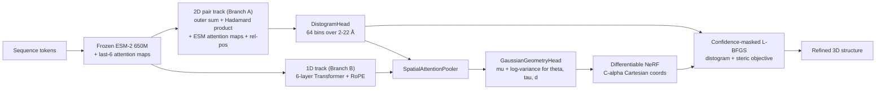

# Single-Sequence Coarse-Grained Protein Structure Prediction

**Learning the latent grammar of proteins with a lightweight, early-branching Transformer.**


This repository contains the code for a TIF360 research project that predicts the
tertiary structure of a protein **directly from a single amino-acid sequence**,
without Multiple Sequence Alignments (MSAs). The model operates on a coarse-grained
Cα representation and combines a frozen ESM-2 protein language model with a
lightweight early-branching Transformer, a 2D pairwise distogram track, a Gaussian
geometry head, and a decoupled L-BFGS physical refinement stage.

The accompanying written report is available at
[`report/Single_Sequence_Prediction_of_Coarse_Grained_Protein_Structure_via_Transformer_Architecture-5.pdf`](report/Single_Sequence_Prediction_of_Coarse_Grained_Protein_Structure_via_Transformer_Architecture-5.pdf).
This README is the **code-side guide**: it explains how the repository is
organized, how to run the pipeline, and how the implementation maps onto the
method described in the report and the formal requirements in
[`specification.md`](specification.md).

---

## Table of contents

- [Motivation](#motivation)
- [Results at a glance](#results-at-a-glance)
- [Method](#method)
- [Repository layout](#repository-layout)
- [Getting started](#getting-started)
- [Configuration](#configuration)
- [Training](#training)
- [Inference, reconstruction, and refinement](#inference-reconstruction-and-refinement)
- [Evaluation](#evaluation)
- [Reproducing the report](#reproducing-the-report)
- [Architecture ablations](#architecture-ablations)
- [Testing](#testing)
- [Code map](#code-map)
- [Known limitations and roadmap](#known-limitations-and-roadmap)
- [References](#references)
- [License](#license)

---

## Motivation

AlphaFold2-class systems achieve near-experimental accuracy by extracting
co-evolutionary signal from MSAs, but that dependency is expensive and breaks down
for orphan proteins, rapidly mutating viral targets, and *de novo* designed
sequences with no evolutionary homologs.

This project explores the opposite trade-off: a **single-sequence**, **coarse-grained**
model that is cheap to train and run. Rather than modelling every heavy atom, the
polypeptide is reduced to its Cα trace, described by three internal coordinates per
residue:

| Symbol | Name | Definition |
| :--- | :--- | :--- |
| $d$ | virtual bond length | Euclidean distance between consecutive Cα atoms |
| $\theta$ | virtual bond angle | planar angle across three consecutive Cα atoms |
| $\tau$ | pseudo-torsion | dihedral angle across four consecutive Cα atoms |

The learning problem is to map an integer-encoded sequence to $(\theta, \tau, d)$
for every residue, then reconstruct Cartesian coordinates and refine global
topology.

---

## Results at a glance

Headline numbers from the report (CASP12 test split, length-stratified). Arrows
indicate the better direction; each cell shows **base → L-BFGS refined**.

| Metric | Global (N=984) | Short (<200, N=603) | Medium (200–499, N=335) | Long (≥500, N=46) |
| :--- | :---: | :---: | :---: | :---: |
| TM-Score (↑) | 0.18 → **0.31** | 0.20 → **0.33** | 0.15 → **0.30** | 0.08 → **0.16** |
| GDT-TS (↑) | 0.12 → **0.22** | 0.18 → **0.29** | 0.03 → **0.11** | 0.00 → **0.01** |
| RMSD, Å (↓) | 18.6 → **12.8** | 12.3 → **9.3** | 25.5 → **16.3** | 50.9 → **33.3** |
| Helix dRMSD, Å (↓) | 0.56 → 0.68 | 0.44 → 0.51 | 0.65 → 0.86 | 1.25 → 1.31 |
| Sheet dRMSD, Å (↓) | 0.46 → 0.57 | 0.36 → 0.47 | 0.50 → 0.62 | 1.05 → 1.10 |
| Clash severity (↓) | 0.19 → 0.25 | 0.16 → **0.11** | 0.25 → 0.47 | 0.22 → 0.48 |

**Key findings**

- The architecture captures global topological scaffolding: refinement lifts mean
  TM-Score from 0.18 to 0.31, with individual short/medium traces reaching 0.73+.
- The Gaussian geometry head's predicted log-variance correlates strongly with true
  angular error, which is what makes confidence-masked refinement effective.
- Torsion ($\tau$) prediction remains the dominant failure mode — frequent
  180° chiral flips. Helix/sheet *local* geometry is already near-Ångström accurate
  before refinement, so refinement can slightly degrade it while fixing global folds.
- Performance degrades with length; RoPE alone does not fully remove the length bias
  introduced by cropping long proteins during training.

---

## Method



1. **Sequence initialization** — a frozen ESM-2 (650M) language model produces
   contextualized per-residue embeddings, plus the raw attention maps from its last
   six layers. No MSAs are used.
2. **Early branching** — the network splits immediately. Branch B is a deep 1D
   Transformer using Rotary Positional Embeddings (RoPE). Branch A is a *shallow*
   2D pairwise track built from a broadcasted outer sum + scaled Hadamard product,
   enriched with symmetrized ESM attention maps (LayerNorm-stabilized) and clamped
   relative positional embeddings (±32 residues).
3. **Distogram head** — an MLP over the pair track predicts a symmetrized
   distribution over 64 distance bins spanning 2–22 Å.
4. **Spatial attention pooling** — a value-projection-free attention layer pools the
   2D probability distributions back into a per-residue 1D context vector using
   queries from the 1D track and keys from the 2D probabilities.
5. **Gaussian geometry head** — predicts an 8-vector per residue:
   $[\mu_\theta, \log\sigma^2_\theta, \mu_\tau, \log\sigma^2_\tau, \mu_d, \log\sigma^2_d]$.
   Angular means are L2-normalized 2D unit vectors (sin/cos); distance uses softplus.
6. **Kinematic reconstruction** — a memory-safe, differentiable NeRF/prefix-scan
   transform converts internal coordinates to Cα Cartesian coordinates
   (`build_ca_coords_nerf`).
7. **Decoupled refinement** — at inference, L-BFGS adjusts $\theta$ and $\tau$ while
   holding $d$ rigid, guided by distogram targets and a softened steric-clash
   penalty. Confident (low-variance) angles have their gradients zeroed so the solver
   only repairs uncertain hinges.

### Loss functions

The training objective is a weighted sum of three terms:

$$\mathcal{L}_{\text{total}} = \lambda_{\text{geom}}\,\mathcal{L}_{\text{NLL}} \;+\; \lambda_{\text{disto}}\,\mathcal{L}_{\text{disto}} \;+\; \lambda_{\text{3D}}\,\mathcal{L}_{\text{3D-local}}$$

| Term | Implementation | Notes |
| :--- | :--- | :--- |
| $\mathcal{L}_{\text{NLL}}$ | `gaussian_nll_loss` | Gaussian NLL over the 2D unit-vector means, plus a small (0.1×) pure-MSE "compass" term on the unscaled angle vectors that fights chiral mode collapse without causing variance inflation. |
| $\mathcal{L}_{\text{disto}}$ | `compute_distogram_loss` | Cross-entropy over 64 bins with label smoothing, sequence-separation weighting (1× local → 5× long-range) and a contact boost, averaged per protein to avoid length domination. |
| $\mathcal{L}_{\text{3D-local}}$ | `compute_local_window_3d_loss` | Sliding-window (w = 16) dRMSD L1 error — supervises local 3D structure without punishing long-range deviations. Computed outside autocast in float32 for numerical stability. |

Report hyperparameters: $\lambda_{\text{geom}} = 0.1$, $\lambda_{\text{disto}} = 0.2$, $\lambda_{\text{3D}} = 1.0$.

---

## Repository layout

```
.
├── configs/                 # YAML experiment configs (versioned)
├── checkpoints/             # Saved model weights (gitignored)
├── outputs/                 # Run artifacts: metrics, PDBs, plots (gitignored)
├── report/                  # The written report (PDF)
├── scripts/                 # Thin shell wrappers
├── sidechainnet_data/       # SidechainNet download cache (gitignored)
├── src/
│   ├── data/                # Dataset, collation, dynamic batching
│   ├── losses/              # Loss implementations
│   ├── models/              # Transformer variants + head/factory code
│   ├── postproc/            # NeRF, exporters, diagnostics, plotting
│   ├── utils/               # Config loading, geometry/metric utilities
│   ├── infer.py             # Evaluation + refinement + export entry point
│   ├── train_confidence_model.py   # Main training entry point
│   └── visualize.py         # Legacy figure-generation script
├── tests/                   # pytest suite
├── specification.md         # Software Requirements Specification
└── requirements.txt
```

> **Note on entry points.** The canonical training entry point is
> `src/train_confidence_model.py`. The helper scripts in `scripts/` are convenience
> wrappers around `python -m src.train`, which is the legacy module path; prefer the
> explicit commands below (or point the wrappers at
> `src.train_confidence_model`).

---

## Getting started

### 1. Environment

```bash
python -m venv .venv
source .venv/bin/activate
python -m pip install --upgrade pip
python -m pip install -r requirements.txt
```

`requirements.txt` pins the core stack (`torch`, `numpy`, `pyyaml`,
`sidechainnet`, `mp-nerf`, `trimesh`, `pytest`). The code additionally imports a
few packages that are **not yet pinned** — install them if you hit `ImportError`:

| Import | Package | Used by |
| :--- | :--- | :--- |
| `esm` | `fair-esm` | ESM-2 650M embeddings |
| `sklearn` | `scikit-learn` | Stratified validation/test subsetting |
| `scipy` | `scipy` | Spearman confidence correlation |
| `matplotlib` | `matplotlib` | Training diagnostics plots |
| `plotly` | `plotly` | Interactive 3D structure HTML exports |
| `torchview` | `torchview` | Model graph inspection |

A CUDA-capable GPU is strongly recommended for training (the report used a 16 GB
card); inference and the test suite can run on CPU.

### 2. Data

The project uses [SidechainNet](https://github.com/jonathanking/sidechainnet)
(CASP12, 30% thinning) as its only data source. SidechainNet downloads and caches
on first use into `sidechainnet_data/` (or the location configured by
SidechainNet itself). No manual `.pdb` parsing is required.

The dataset layer computes coarse-grained targets on the fly from Cα coordinates
(`ca_to_internal_targets` in `src/data/dataset_full.py`):
$(\sin\theta, \cos\theta, \sin\tau, \cos\tau)$ plus the virtual bond distance, with
a cascading mask so that residues invalidated by missing data do not leak into the
loss. Long training proteins are randomly cropped (default `max_len: 200`);
validation/test proteins are evaluated in full.

### 3. Quickstart

```bash
# Train the architecture used in the report
python -m src.train_confidence_model --config configs/early_branching_confidence_attn.yaml

# Evaluate on the CASP12 test split (base vs. L-BFGS-refined), export metrics + PDBs + plots
python -m src.infer --config configs/early_branching_confidence_attn.yaml
```

Run the test suite:

```bash
pytest -q
```

---

## Configuration

All experiments are driven by YAML files in `configs/`. The loader
(`src/utils/config.py`) resolves the config path in this order:

1. `--config <path>` CLI flag
2. the `CONFIG_NAME` environment variable (a filename under `configs/`)
3. fallback: `configs/example.yaml`

**Every entry point exposes only `--config`** — this is deliberate, to keep runs
reproducible and fully described by the versioned YAML.

```bash
CONFIG_NAME=early_branching_confidence_attn.yaml python -m src.infer
```

### Schema

| Section | Key | Purpose |
| :--- | :--- | :--- |
| `phase`, `seed`, `device` | — | Run metadata, RNG seed (`42`), `cuda`/`cpu` |
| `data` | `split`, `max_len`, `max_len_valid`, `max_len_test`, `casp_version`, `thinning`, `dynamic_batching`, `subset_size_*` | SidechainNet split, cropping, and evaluation subsetting |
| `model` | `d_model`, `nhead`, `num_layers`, `dim_feedforward`, `dropout`, `d_pair`, `head_hidden`, `max_len` | Transformer and head dimensions |
| `model` | `arch_override` | Selects a hard-coded architecture (see below) |
| `model` | `block_type`, `head_mode`, `num_ss_classes`, `esm_mode`, `esm_unfreeze_last_n`, `pair_context_to_head`, `learned_vocab_size` | Feature toggles for the factory-built `ProteinFoldingNetwork` |
| `training` | `lr`, `min_lr_ratio`, `total_steps`, `warmup_steps`, `decay_steps`, `max_tokens`, `megabatch_size`, `accumulation_steps`, `checkpoint_interval`, `logging_interval`, `resume_from_checkpoint`, `checkpoint_path` | Optimizer, LR schedule, dynamic batching, checkpointing |
| `loss` | `lambda_geom`, `lambda_disto`, `lambda_3d_local` (and legacy `lambda_distance` / `lambda_3d` / `use_3d_loss`) | Loss weighting |
| `inference` | `checkpoint_path`, `max_tokens` | Checkpoint to load at eval time |
| `postproc` | `use_nerf`, `nerf_impl` | Reconstruction backend (`mpnerf` or sequential) |
| `export` | `output_dir`, `pdb`, `gltf` | Where artifacts are written |

### `arch_override` values

`build_model_from_cfg` (`src/models/factory.py`) dispatches on `model.arch_override`:

| `arch_override` | Class | Config example |
| :--- | :--- | :--- |
| `early_branching_confidence_network` | `EarlyBranchingConfidenceNetwork` | `early_branching_confidence_attn.yaml` |
| `early_branching_network` | `EarlyBranchingNetwork` | `early_branching.yaml` |
| `iterative_diamond_confidence_network` | `IterativeDiamondConfidenceNetwork` | `iterative_diamond_confidence.yaml` |
| `late_branching_network` | `LateBranchingNetwork` | `late_branching.yaml` |
| `explainable_two_track` | `TwoTrackNetwork` | `two_track.yaml` |
| `explainable_pair_bias` | `PairBiasNetwork` | `pair_bias.yaml` |
| *(unset)* | `ProteinFoldingNetwork` (factory-assembled) | `example.yaml`, `full_train_eval.yaml` |

When `arch_override` is unset, the factory builds a configurable
`ProteinFoldingNetwork` from `block_type` / `head_mode` / `esm_mode` toggles. The
defaults reproduce the two-track + hierarchical secondary-structure head baseline.

> **Important:** the class selected by `arch_override` determines the model's
> forward signature. `EarlyBranchingConfidenceNetwork` returns
> `(pred_1d, disto_logits)`, whereas the factory-built `ProteinFoldingNetwork`
> returns `(pred_1d, ss_logits, disto_logits)`. `src/infer.py` expects the
> two-tuple output from the confidence network.

---

## Training

```bash
python -m src.train_confidence_model --config configs/early_branching_confidence_attn.yaml
```

What the loop does (`src/train_confidence_model.py`):

| Stage | Implementation |
| :--- | :--- |
| Data loading | `build_loader` → `ProteinDataset` + `MaxTokensBatchSampler` |
| Healthy-length validation set | `build_valid_eval_loader` (`valid-10`, stratified subset) |
| Augmented loop | `get_infinite_batches` wraps the finite DataLoader for step-based training |
| Forward | `model(tokens, src_key_padding_mask=pad_mask)` inside `torch.autocast(bfloat16)` |
| Loss | `gaussian_nll_loss` + `compute_distogram_loss` + `compute_local_window_3d_loss` |
| Optimizer | AdamW (`weight_decay = 1e-4`), linear warmup → cosine decay to `min_lr_ratio` |
| Accumulation | `accumulation_steps` micro-batches; gradient clipping at norm 1.0 |
| Checkpointing | Atomic `torch.save` → `.tmp` → `os.replace` at `checkpoint_interval` |

**Batching strategy.** To maximise throughput on highly variable protein lengths,
`MaxTokensBatchSampler` groups similar-length proteins until a strict token budget
(`max_tokens`) is reached, minimising padding. The report config uses
`max_tokens: 2500` with `accumulation_steps: 8`, i.e. ~20,000 tokens per optimizer
step.

**Schedules.** The report used `lr = 5e-4`, 1,000 warmup steps, and a 10,000-step
cosine decay over 10,000 total steps.

**Checkpoints** store `model`, `optimizer`, `scheduler`, `global_step`, and
`total_tokens_seen`, so `resume_from_checkpoint: true` restores training exactly.

---

## Inference, reconstruction, and refinement

```bash
python -m src.infer --config configs/early_branching_confidence_attn.yaml
```

`src/infer.py` runs the full evaluation pipeline:

1. Load the CASP12 `test` split and the configured checkpoint.
2. Predict internal coordinates and distogram logits in `bfloat16`.
3. Reconstruct **base** Cα coordinates via the differentiable NeRF transform
   (`angles_to_3d_coords_memory_safe`).
4. Convert distogram logits to expected distances + entropy
   (`distogram_kinematics`).
5. Run `masked_torsion_refinement_lbfgs` to produce **refined** coordinates.
6. Score both, write per-sample exports, and aggregate stratified summaries.

### Confidence-masked L-BFGS refinement

| Setting | Value | Meaning |
| :--- | :--- | :--- |
| Optimizer | L-BFGS, `lr = 1.0`, strong Wolfe | 5 outer steps × up to 20 iterations |
| Frozen angles | $\log\sigma^2_\theta < -1.0$, $\log\sigma^2_\tau < -2.0$ | Confident angles get zeroed gradients |
| Frozen bond lengths | always | Only angles are optimised ($d$ held rigid) |
| Contact cutoff | 16.0 Å | Only distogram pairs closer than this attract |
| Entropy cutoff | 4.0 | Ignore high-uncertainty distogram bins |
| Steric clash | 3.8 Å, $\lambda_{\text{clash}} = 10.0$, exclude $\lvert i-j\rvert \le 2$ | Quadratically smoothed repulsion |
| Early stop | total loss < 0.1 | Halt refinement once converged |

The refinement objective is
$\mathcal{L}_{\text{refine}} = \mathcal{L}_{\text{disto-target}} + \lambda_{\text{clash}}\,\mathcal{L}_{\text{steric}}$:
an attractive MSE to high-confidence distogram targets plus a repulsive steric
penalty. This is the mechanism that repairs chiral traps and hinge errors.

### Reconstruction and export backends

- `src/utils/structure_eval.py::build_ca_coords_nerf` — differentiable,
  prefix-scan NeRF used inside the training/eval graph.
- `src/postproc/nerf_runner.py` — sequential NeRF plus an `mp-nerf` parallel
  backend with explicit fallback logging.
- `src/postproc/exporters.py` — `write_pdb` (`.pdb`) and `write_gltf` (glTF via
  `trimesh`, falling back to a JSON payload).

Artifacts land in `export.output_dir`, including per-sample
`*_base.pdb`, `*_refined.pdb`, `*_true.pdb`, and interactive Plotly HTML plots for
base-vs-refined-vs-true comparison, angular error vs. uncertainty, Gaussian
Ramachandran maps, and distogram diagnostics.

---

## Evaluation

`src/infer.py` reports metrics for both base and refined coordinates, stratified
into **short (<200)**, **medium (200–499)**, and **long (≥500)** buckets. It also
writes `evaluation_metrics_comparison.csv` to the output directory.

| Metric | Function | Direction |
| :--- | :--- | :--- |
| TM-Score | `calculate_tm_score` | ↑ (primary, length-normalized) |
| GDT-TS | `calculate_gdt_ts` | ↑ |
| RMSD (Kabsch-aligned) | `kabsch_align` + manual RMSD | ↓ |
| Top-L/2 long-contact precision | `calculate_top_l_half_long_contact_precision` (3D), `..._2d` | ↑ |
| Contiguous helix/sheet dRMSD | `compute_contiguous_drmsd` | ↓ |
| Steric clashes per 100 residues | `calculate_steric_clashes` | ↓ |
| Confidence calibration | Spearman(log-var, angle error) + binning | ↑ |

The **confidence calibration** block is central to the paper's argument: it
demonstrates that predicted log-variance tracks true angular error, which is the
precondition for confidence-masked refinement. It is also the mechanism that
enables the secondary-structure gains to be traded for global-topology gains.

---

## Reproducing the report

The report's configuration corresponds to
[`configs/early_branching_confidence_attn.yaml`](configs/early_branching_confidence_attn.yaml):

| Report parameter | Config key | Value |
| :--- | :--- | :--- |
| 1D Transformer | `model.num_layers` / `nhead` / `dim_feedforward` / `dropout` | 6 / 8 / 1024 / 0.1 |
| Model width | `model.d_model` / `d_pair` | 256 / 128 |
| Token budget | `training.max_tokens` × `accumulation_steps` | 2500 × 8 ≈ 20k |
| Peak LR / schedule | `training.lr`, `warmup_steps`, `decay_steps`, `total_steps` | 5e-4, 1000, 10000, 10000 |
| Loss weights | `loss.lambda_geom` / `lambda_disto` / `lambda_3d_local` | 0.1 / 0.2 / 1.0 |
| Checkpoint | `training.checkpoint_path` | `checkpoints/early_branching_confidence_attn_map_only.pt` |

To reproduce end-to-end:

```bash
python -m src.train_confidence_model --config configs/early_branching_confidence_attn.yaml
python -m src.infer --config configs/early_branching_confidence_attn.yaml
```

A previously trained checkpoint and its output artifacts are retained under
`checkpoints/` and `outputs/early_branching_confidence_attn_map_only/`
(both gitignored). The reference metrics table is also summarized at the repo root
in `evaluation_metrics_summary_650M_120000_steps.csv`.

> **Hardware / reproducibility note:** the report used a single 16 GB GPU, ~5 hours
> of training, and `seed: 42`. Exact metric reproduction depends on GPU/kernel
> nondeterminism (esp. `scaled_dot_product_attention` and `bfloat16`).

---

## Architecture ablations

The `configs/` directory doubles as an ablation registry — each config pins a
different architectural hypothesis:

| Config | Hypothesis under test |
| :--- | :--- |
| `early_branching_confidence_attn.yaml` | **Report model**: ESM attention maps injected into the 2D track |
| `early_branching_confidence_mini.yaml` | Same design, reduced compute footprint |
| `early_branching_confidence.yaml` | Confidence head without ESM attention-map injection |
| `early_branching.yaml` | Early branching without the confidence/geometry head |
| `two_track.yaml` | Explainable two-track baseline (persistent pair track) |
| `late_branching.yaml` | Pair track integrated later rather than at the start |
| `pair_bias.yaml` | Pair-bias attention without a persistent 2D track |
| `iterative_diamond_confidence.yaml` | Iterative/diamond refinement of the pair representation |
| `full_train_eval*.yaml` | Larger factory-built `ProteinFoldingNetwork` variants (`1d`, `3d_loss`, `twotrack`, `trig_only`) |

Per-sample ablation metrics from a 100-residue MDS/L-BFGS comparison study are in
`outputs/ablation_study_results.csv`.

---

## Testing

```bash
pytest -q
```

| Test file | Covers |
| :--- | :--- |
| `test_config_loader.py` | `--config` / `CONFIG_NAME` resolution and defaults |
| `test_dataset_collate.py` | Dataset item shapes and padding-aware collation |
| `test_internal_targets.py` | Cα → $(\theta,\tau,d)$ target computation |
| `test_trig_loss.py` | Trig-loss math and sin/cos conversion |
| `test_model_smoke.py` | Forward passes for the factory model variants |
| `test_custom_nerf.py` | NeRF round-trip fidelity and differentiability |
| `test_nerf_runner.py` / `test_nerf_backend.py` | Sequential NeRF and MP-NeRF fallback |
| `test_exporters.py` | `.pdb` writer output |
| `test_flash_attention.py` | SDPA attention path |
| `test_pipeline_diagnostics.py` | Geometry round-trip vs. real protein, single-sequence overfit, padding isolation |

Many tests are deliberately lightweight and dataset-independent so the suite runs
without the SidechainNet download.

---

## Code map

| Path | Responsibility |
| :--- | :--- |
| `src/utils/config.py` | CLI/env config resolution; normalizes loss defaults |
| `src/data/dataset_full.py` | `ProteinDataset`, `ca_to_internal_targets`, `collate_fn`, ESM/DSSP vocabularies |
| `src/data/batching.py` | `BucketBatchSampler`, `MaxTokensBatchSampler` |
| `src/models/factory.py` | `build_model_from_cfg`, `ModelSpec`, embedder selection, `arch_override` dispatch |
| `src/models/early_branching_confidence_transformer.py` | **Report model**: `FrozenESMEmbedder`, `OneDTransformerBlock`, `DistogramHead`, `SpatialAttentionPooler`, `GaussianGeometryHead`, `EarlyBranchingConfidenceNetwork` |
| `src/models/transformer.py` | `TransformerBackbone`, `TwoTrack_TransformerBlock`, `ProteinFoldingNetwork` |
| `src/models/heads.py` | Trig / hierarchical-SS head variants |
| `src/models/{two_track,late_branching,pair_bias,iterative_diamond_confidence}_*.py` | Ablation architectures |
| `src/losses/torch_trig_loss.py` | `end_to_end_loss` (trig + dRMSD + SS + distogram) used by tests/legacy path |
| `src/utils/structure_eval.py` | Differentiable `build_ca_coords_nerf`, dRMSD/TM/GDT/clash/top-L metrics |
| `src/postproc/nerf_runner.py` | Sequential + MP-NeRF reconstruction backends |
| `src/postproc/exporters.py` | PDB / glTF writers |
| `src/postproc/diagnostics.py` | RMSD and lever-arm ratio diagnostics |
| `src/postproc/visualize.py` | Plotly/Matplotlib diagnostics and Plotly 3D exports |
| `src/infer.py` | Evaluation, L-BFGS refinement, stratified summaries, CSV/plot export |
| `src/train_confidence_model.py` | **Main training loop** |

---

## Known limitations and roadmap

From the report's conclusion, plus implementation notes:

- **Chiral confusion.** 180° torsion flips remain the dominant error mode. The
  small MSE "compass" term mitigates but does not solve it. Future work: direct 3D
  coordinate attention or local-frame (FAPE-style) losses inside the forward pass.
- **Length bias.** Scores drop sharply beyond 500 residues; the training-time crop
  likely introduces a length bias even with RoPE. Future work: stronger
  length-invariant positional schemes.
- **Refinement trade-off.** Refinement improves global topology but can *worsen*
  near-perfect secondary-structure dRMSD and increase steric clash severity, because
  base predictions are often under-dense.
- **Complexity not fully ablated.** Several choices (notably spatial attention
  pooling) were validated with short runs and could be replaced by simpler,
  more interpretable alternatives.
- **Packaging.** `requirements.txt` does not pin several imports (`fair-esm`,
  `scikit-learn`, `scipy`, `matplotlib`, `plotly`, `torchview`), and the
  `scripts/*.sh` wrappers point at the legacy `src.train` module path.
- **Reproducibility.** Determinism is seeded (`seed: 42`) but not bit-exact across
  GPUs.

---

## References

The method builds on the following works (see the report for the full list):

1. R. Chowdhury et al., *Single-sequence protein structure prediction using language models from deep learning*, Nature Biotechnology (2022).
2. J. Jumper et al., *Highly accurate protein structure prediction with AlphaFold*, Nature (2021).
3. Z. Lin et al., *Evolutionary-scale prediction of atomic-level protein structure with a language model* (ESM-2), Science (2023).
4. J. Su et al., *RoFormer: Enhanced Transformer with Rotary Position Embedding* (RoPE), Neurocomputing (2024).
5. J. Parsons et al., *Practical conversion from torsion space to Cartesian space in silico protein synthesis* (NeRF), J. Comput. Chem. (2005).
6. D. C. Liu & J. Nocedal, *On the limited memory BFGS method for large scale optimization*, Math. Program. (1989).
7. J. E. King & D. R. Koes, *SidechainNet: An all-atom protein structure dataset for machine learning*, Proteins (2021).
8. Y. Zhang & J. Skolnick, *Scoring function for automated assessment of protein structure template quality* (TM-Score), Proteins (2004).
9. W. Kabsch, *A solution for the best rotation to relate two sets of vectors*, Acta Cryst. A (1976).

Formal requirements mapping (REQ-DI-1.x, REQ-NN-1.x, REQ-LF-1.x, REQ-PP-2.x,
REQ-EX-3.x) is maintained in [`specification.md`](specification.md).

---

## License

No license file is currently included in this repository. The code and report were
produced as a TIF360 course project (author: Noah Andreasson). Add a `LICENSE` file
before reuse.
